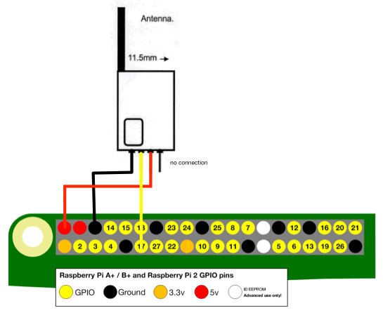
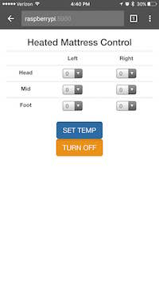

# snuggletronics
Wirelessly controlled Sunbeam® heated mattress pads with a Raspberry Pi.

Snuggletronics project allows you to take control of your Sunbeam heated mattress pad so that you bed is toast warm exactly when you want it to be. Snuggletronics also lets you remote control your mattress pad from your phone, tablet, or computer. 

You need only add a $4 radio module connected to a Raspberry Pi to take advantage of this application. In addition to the easy web interface, Snuggletronics presents a REST API which will allow you to control your mattress heat however you like!

# NOTE: alpha release, 
Most notably missing data analysis, which means control is restricted to 10 averaged power settings (no zone heating). In the near future, after further data analysis full granularity of control will be provided

see  [docs/TODO.md](docs/TODO.md) for tasks not yet done

## Software Requirements
 * bower to install angular and bootstrap (defined by .bowerrc and bower.json)
 * python 3.3+ (to run flask)
 * python modules: flask-restful, wiringPi2

## Hardware Requirements
 * Raspberry Pi 
 * 418MHZ ASK/OOK transmitter module

This circuit an program have been built and test on Rasberry Pi 2, with 418MHZ ASK/OOK transmitter module STPA-418H–B. 

The STPA-418H–B is available from Circuit Specialist (no affiliation) [http://www.circuitspecialists.com/stpa-418h-b.html](http://www.circuitspecialists.com/stpa-418h-b.html). The 

Raspberry Pi is commonly available but I encourage you to keep our maker/hacker ecosystem fertile and support vendors that create original open source hardware [adafruit](http://adafruit.com) or [sparkfun](http://sparkfun.com)

## The Circuit

The circuit is quite elementary, simply connect VCC to GPIO +5v, GND to GPIO GND, and Data to GPIO 17 as illustrate here:

## Installation

Install npm and bower if you have not yet had a chance to do so.

### install npm:

    sudo apt-get install nodejs npm
    
    # note: the following command fixes a common ubuntu npm issue, this may not be necessary in the near future
    sudo ln -s /usr/bin/nodejs /usr/bin/node 

### install bower:

    sudo npm install -g bower

### install angular, jquery, and bootstrap

bower is used to install javascript and css components of angular, bootstrap, and jquery, these dependencies are configured via bower.json and the target directory is set via .bowerrc

     # make sure you are in the directry where this README.md is located
     cd snuggletronics
     
     # install dependencies 
     bower install 

### install flask-restful

GPIO requires escalated privileges, so the easiest manner to install and run this software is to us pip3 to manually install all modules used:

    pip3 install flask-restful

### install WiringPi2

WiringPi2 needs to be built manuallly. Find canonical directions at [https://github.com/Gadgetoid/WiringPi2-Python](https://github.com/Gadgetoid/WiringPi2-Python) 

## Running the Application

Because GPIO requires escalated privileges, simply start using sudo

    sudo python3 runserver.py

Normal start up example:

    pi@raspberrypi:~/snuggletronics $ sudo python3 runserver.py 
    * Running on http://0.0.0.0:5000/ (Press CTRL+C to quit)
    * Restarting with stat
    * Debugger is active!
    * Debugger pin code: 280-224-703

You may, of course, also wrap with an service execution script and run as daemon, if you do so please send a merge request :)

Viewed through browser

## The API

### Mattress State Resource

**Resource URL:** /api/v1/mattress 

Actions: 
**HTTP GET** Retrieve last state set. 
*Arguments:* none.
*Response:*  Mattress State DTO representing last set state

Note that because the mattress pad does not transmit state back (it only receives commands), **GET** method will only return state of last sent command, and not current state of mattress. Common scenarios for mattress state being different than last sent state include original remote being used in tandem with this application, heater becoming unplugged, or failure to receive transmission. 

    # Example
    $ curl http://127.0.0.1:5000/api/v1/mattress
    {
        "left_foot_power": 0,
        "left_head_power": 0,
        "left_middle_power": 0,
        "right_foot_power": 0,
        "right_head_power": 0,
        "right_middle_power": 0
    }
  
**HTTP PUT** Send power state to mattress.
*Arguments:* Mattress State DTO as data
*Response:*  Mattress State DTO representing last set state

Sends command to mattress heater, upon receipt of valid Mattress State DTO data element. Will turn off mattress if all six required power fields are set to zero OR if power_on element is set to false (regardless of presence of non-zero power fields).

    # Example
    $ curl -H "Content-Type: application/json" -X PUT -d '{"left_foot_power":3,"left_head_power":0,"left_middle_power":0,"right_foot_power":0,"right_head_power":0,"right_middle_power":3,"hour":5,"minute":3}' http://127.0.0.1:5000/api/v1/mattress
    {
        "left_foot_power": 1,
        "left_head_power": 1,
        "left_middle_power": 1,
        "right_foot_power": 1,
        "right_head_power": 1,
        "right_middle_power": 1
    }

### Daily Mattress Heater Jobs

**Resource URL:**  /api/v1/mattress/jobs
A simple daily mattress heater job scheduler.

Because mattress thermal change rate is so slow, jobs may be scheduled to the minute of the day. Three actions allow you to list, delete, or create/update mattress heater jobs. As a consequence of mattress jobs being unique by hour and minute of the day, there is no need for id tokens that you might expect of a 'normal' rest interface (use hour and minute instead).

**HTTP GET** Retrieve list of mattress heater jobs
*Arguments:* None
*Response:*  Mattress State JOB List DTO all scheduled jobs, ordered by hour/minute ascending

**Example**

    $ curl http://127.0.0.1:5000/api/v1/mattress/jobs
    [
        {
            "hour": 20,
            "left_foot_power": 10,
            "left_head_power": 10,
            "left_middle_power": 10,
            "minute": 15,
            "right_foot_power": 10,
            "right_head_power": 10,
            "right_middle_power": 10
        },
        {
            "hour": 22,
            "left_foot_power": 3,
            "left_head_power": 0,
            "left_middle_power": 0,
            "minute": 0,
            "right_foot_power": 3,
            "right_head_power": 0,
            "right_middle_power": 0
        },
        {
            "hour": 7,
            "left_foot_power": 0,
            "left_head_power": 0,
            "left_middle_power": 0,
            "minute": 0,
            "right_foot_power": 0,
            "right_head_power": 0,
            "right_middle_power": 0
        }
    ]

**HTTP DELETE** Deletes Mattress Heater Job
*Arguments:* Daily Job DTO as data
*Response:*  HTTP 204

Deletes job corresponding to hour and minute specified if it exists. If no corresponding job exists, no change is made 204 is returned in either case.

**Example**

    $ curl -H "Content-Type: application/json" -X DELETE -d '{"hour":22,"minute":0}' http://127.0.0.1:5000/api/v1/mattress/jobs

**HTTP POST** Creates or Updates Mattress Heater Job
*Arguments:* Mattress State Daily Jobs DTO as data
*Response:* HTTP 200

**Example**

    curl -H "Content-Type: application/json" -X POST -d '{"left_foot_power":3,"left_head_power":0,"left_middle_power":0,"right_foot_power":0,"right_head_power":0,"right_middle_power":3,"hour":5,"minute":3}' http://127.0.0.1:5000/api/v1/mattress/jobs

## JSON DTOs:

### Mattress State DTO:
JSON object containing the following pair members

 * *left_foot_power*: integer 0 through 10, required
 * *left_head_power*: integer 0 through 10, required
 * *left_middle_power*: integer 0 through 10, required
 * *right_foot_power*: integer 0 through 10, required
 * *right_head_power*: integer 0 through 10, required
 * *right_middle_power*: integer 0 through 10, required
 * *power_on*: boolean, optional (default true)
 
 **Example:**
 
    {
        "left_foot_power": 3,
        "left_head_power": 0,
        "left_middle_power": 0,
        "right_foot_power": 3,
        "right_head_power": 0,
        "right_middle_power": 0
    }

### Daily Job DTO:
Only used for deleting jobs.

 * *hour*: integer 0 through 24, required
 * *minute*: integer 0 through 59, required

**Example:**
 
    {
        "hour": 20,
        "minute": 15,
    }

### Mattress State Daily Jobs DTO:
All of Mattress State DTO object with the addition of the the two pair members (hour & minute) of Daily Job DTO.

**Example:**
 
    {
        "left_foot_power": 10,
        "left_head_power": 10,
        "left_middle_power": 10,
        "right_foot_power": 10,
        "right_head_power": 10,
        "right_middle_power": 10,
        "hour": 20,
        "minute": 15,
    }

### Mattress State JOB List DTO:
A list containing Mattress State Jobs

**Example:**

    [
        {
            "hour": 20,
            "left_foot_power": 10,
            "left_head_power": 10,
            "left_middle_power": 10,
            "minute": 15,
            "right_foot_power": 10,
            "right_head_power": 10,
            "right_middle_power": 10
        },
        {
            "hour": 22,
            "left_foot_power": 3,
            "left_head_power": 0,
            "left_middle_power": 0,
            "minute": 0,
            "right_foot_power": 3,
            "right_head_power": 0,
            "right_middle_power": 0
        },
        {
            "hour": 7,
            "left_foot_power": 0,
            "left_head_power": 0,
            "left_middle_power": 0,
            "minute": 0,
            "right_foot_power": 0,
            "right_head_power": 0,
            "right_middle_power": 0
        }
    ]

# Mattress Heater Remote FCC Link
https://apps.fcc.gov/oetcf/eas/reports/ViewExhibitReport.cfm?mode=Exhibits&RequestTimeout=500&calledFromFrame=N&application_id=omyk5lsFp8UZHuBL655tKw%3D%3D&fcc_id=O38-L85KQR

# Licenses

 

Snuggletronics Readme and Instructions
by <a href="https://github.com/majikthys"> Jeremy Franklin-Ross</a> is licensed under a <a rel="license" href="http://creativecommons.org/licenses/by/4.0/">  Creative Commons Attribution 4.0 International License </a>. 
Based on a work at <a href="https://github.com/majikthys/snuggletronics/blob/master/README.md" rel="dct:source"> https://github.com/majikthys/snuggletronics/</a>. 

Application and software is licensed in MIT License: <a href="https://github.com/majikthys/snuggletronics/blob/master/LICENSE">
    https://github.com/majikthys/snuggletronics/blob/master/LICENSE</a>
